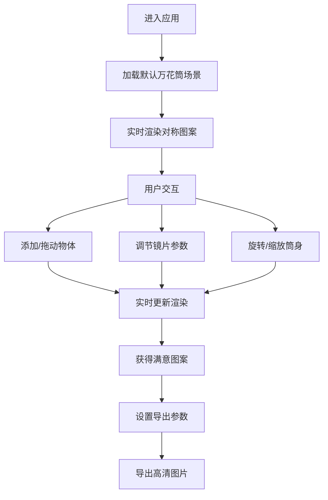

## 1. 产品概述

3D虚拟万花筒是一款沉浸式的创意工具，让用户通过实时3D渲染体验无限变化的对称图案。用户可以调节镜片数量和角度，放置彩色珠子或几何体，实时预览镜面反射生成的绚丽花纹，并将精美的对称图案导出为高清壁纸或设计素材。

- 面向设计师、艺术爱好者、普通用户的创意可视化工具
- 融合传统万花筒的视觉魔法与现代3D交互技术，提供即时的创作乐趣

## 2. 核心功能

### 2.1 功能模块

1. **主场景页**：3D万花筒实时渲染、对称图案预览、物体操作区域
2. **控制面板**：镜片参数调节、物体属性编辑、全局设置
3. **导出系统**：高清图片导出、分辨率选择

### 2.2 页面详情

| 页面名称 | 模块名称 | 功能描述 |
|-----------|-------------|---------------------|
| 主场景页 | 3D万花筒场景 | 实时渲染筒身、内部物体、多面镜面反射效果，生成对称图案 |
| 主场景页 | 图案预览区 | 正圆形的对称图案实时预览，支持全屏查看 |
| 主场景页 | 物体工具栏 | 快速添加预设的彩色几何体（球体、立方体、八面体、圆环等） |
| 控制面板 | 镜片设置 | 调节镜片数量（3-12片）、镜面角度、反射强度 |
| 控制面板 | 筒身控制 | 控制万花筒旋转速度、旋转方向、视角缩放 |
| 控制面板 | 物体属性 | 选中物体后调节位置、大小、颜色、材质光泽 |
| 控制面板 | 导出设置 | 选择导出分辨率（1080p/2K/4K）、格式（PNG/JPG）、一键导出 |

## 3. 核心流程

用户进入应用后，默认看到一个预置的万花筒场景正在旋转。用户可以：
1. 从工具栏拖入新的彩色几何体到万花筒内部
2. 使用控制面板调节镜片数量、角度，观察对称图案的实时变化
3. 旋转筒身或调节参数，获得满意的图案效果
4. 选择分辨率和格式，一键导出高清图片

## 4. 用户界面设计

### 4.1 设计风格
- **设计方向**：迷幻艺术 + 极简科技感，深色主题配合高饱和度彩色元素
- **主色调**：深邃靛蓝 `#0a0e27` 作为背景，配合霓虹粉 `#ff2d95`、电光蓝 `#00f0ff`、亮紫 `#b967ff` 作为点缀
- **按钮风格**：圆角玻璃拟态按钮，带微发光边缘，hover时有光效流动
- **字体**：主标题使用富未来感的显示字体，正文使用清晰易读的无衬线字体
- **布局**：左侧为3D场景主区域，右侧悬浮控制面板，底部工具栏
- **视觉层次**：通过光晕、模糊、发光边缘营造深度感

### 4.2 页面设计概述

| 页面名称 | 模块名称 | UI元素 |
|-----------|-------------|-------------|
| 主场景页 | 3D场景区 | 深色背景、发光万花筒筒身、内部漂浮彩色几何体、镜面高光反射 |
| 主场景页 | 图案预览区 | 正圆形画框、霓虹发光边框、实时对称图案 |
| 主场景页 | 物体工具栏 | 半透明玻璃面板、彩色几何体缩略图、拖拽高亮效果 |
| 控制面板 | 参数滑块 | 渐变轨道滑块、发光拖动按钮、实时数值显示 |
| 控制面板 | 颜色选择器 | 圆形色板、渐变预设、最近使用色 |
| 控制面板 | 导出按钮 | 发光渐变按钮、加载动画、成功提示 |

### 4.3 响应式设计
- 桌面端优先：左侧70%场景区 + 右侧30%控制面板
- 平板端：上下布局，上半部分场景，下半部分折叠式控制面板
- 移动端：竖屏全屏场景，底部抽屉式控制面板，支持触摸拖拽

### 4.4 3D场景指南
- **环境与氛围**：深色宇宙空间背景，微弱星点粒子，彩色体积光
- **光照设置**：点光源（彩色渐变）+ 环境光 + 内部发光物体自发光
- **相机设置**：外部透视相机观察筒身，内部正交相机渲染对称图案
- **构图与焦点**：图案预览区为视觉中心，筒身为次要焦点
- **交互与动画**：筒身持续缓慢旋转，物体微微漂浮，参数变化时平滑过渡
- **后处理效果**：Bloom泛光、轻微色差、胶片颗粒感
- **性能预算**：维持60fps，物体数量限制在50个以内
