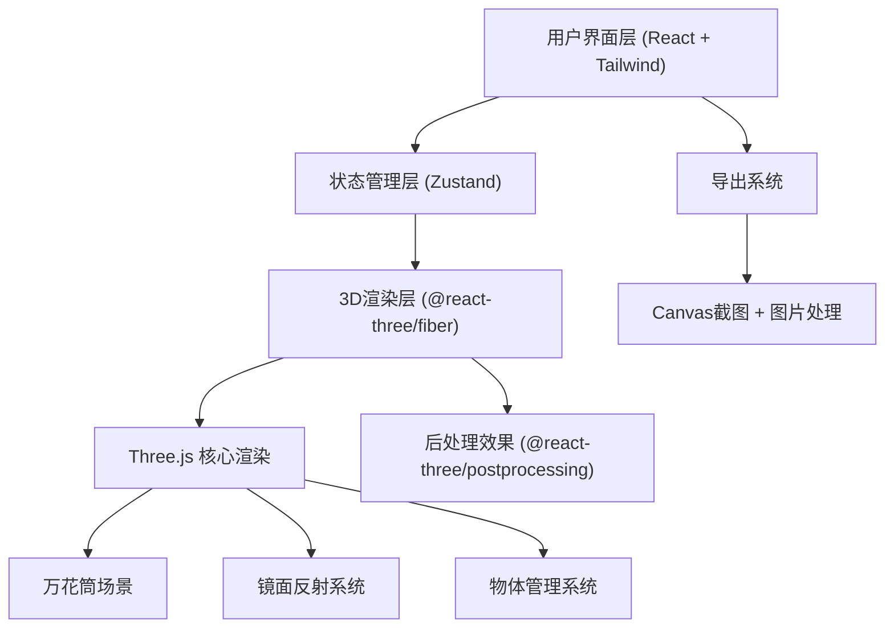

## 1. 架构设计



## 2. 技术描述

- **前端框架**：React@18 + TypeScript + Vite
- **样式方案**：TailwindCSS@3 + CSS自定义变量（主题色管理）
- **状态管理**：Zustand（轻量级状态管理，管理万花筒参数、物体列表、选中状态）
- **3D渲染引擎**：
  - `three` — Three.js核心库
  - `@react-three/fiber` — React渲染器
  - `@react-three/drei` — 常用3D组件辅助库
  - `@react-three/postprocessing` — 后处理效果（Bloom泛光等）
- **初始化工具**：vite-init（react-ts模板）

## 3. 路由定义

| 路由 | 用途 |
|-------|---------|
| / | 主应用页面，包含3D场景、控制面板、导出功能 |

## 4. 模块与目录结构

```
src/
├── components/
│   ├── KaleidoscopeScene/       # 3D万花筒场景组件
│   │   ├── KaleidoscopeScene.tsx    # 场景容器
│   │   ├── MirrorSystem.tsx         # 镜面反射系统
│   │   ├── KaleidoObjects.tsx       # 内部彩色物体
│   │   └── CylinderBody.tsx         # 万花筒筒身
│   ├── PatternPreview/           # 对称图案预览组件
│   │   └── PatternPreview.tsx
│   ├── ControlPanel/             # 右侧控制面板
│   │   ├── ControlPanel.tsx
│   │   ├── MirrorControls.tsx       # 镜片参数控制
│   │   ├── ObjectControls.tsx       # 物体属性控制
│   │   ├── RotationControls.tsx     # 旋转控制
│   │   └── ExportControls.tsx       # 导出控制
│   ├── ObjectToolbar/            # 底部物体工具栏
│   │   └── ObjectToolbar.tsx
│   └── ui/                       # 基础UI组件
│       ├── Slider.tsx
│       ├── ColorPicker.tsx
│       └── GlassButton.tsx
├── hooks/
│   ├── useKaleidoscopeStore.ts   # Zustand状态管理
│   ├── usePatternRender.ts       # 图案渲染逻辑
│   └── useExport.ts              # 导出功能hook
├── types/
│   └── index.ts                  # TypeScript类型定义
├── utils/
│   ├── geometry.ts               # 几何计算工具
│   └── colors.ts                 # 颜色工具函数
├── pages/
│   └── Home.tsx                  # 主页面
├── App.tsx
├── main.tsx
└── index.css
```

## 5. 核心数据模型

### 5.1 类型定义

```typescript
// 万花筒物体类型
interface KaleidoObject {
  id: string;
  type: 'sphere' | 'box' | 'octahedron' | 'torus' | 'cone' | 'tetrahedron';
  position: [number, number, number];
  scale: number;
  color: string;
  emissive: string;
  emissiveIntensity: number;
  roughness: number;
  metalness: number;
}

// 镜片配置
interface MirrorConfig {
  count: number;           // 镜片数量 3-12
  angle: number;           // 镜面角度偏移
  reflectivity: number;    // 反射强度 0-1
}

// 旋转配置
interface RotationConfig {
  speed: number;           // 旋转速度
  direction: 1 | -1;       // 旋转方向
  autoRotate: boolean;     // 是否自动旋转
}

// 导出配置
interface ExportConfig {
  resolution: '1080p' | '2k' | '4k';
  format: 'png' | 'jpg';
  quality: number;
}

// 全局状态
interface KaleidoscopeState {
  objects: KaleidoObject[];
  selectedObjectId: string | null;
  mirrorConfig: MirrorConfig;
  rotationConfig: RotationConfig;
  exportConfig: ExportConfig;
  addObject: (obj: Omit<KaleidoObject, 'id'>) => void;
  removeObject: (id: string) => void;
  updateObject: (id: string, updates: Partial<KaleidoObject>) => void;
  selectObject: (id: string | null) => void;
  updateMirrorConfig: (config: Partial<MirrorConfig>) => void;
  updateRotationConfig: (config: Partial<RotationConfig>) => void;
  updateExportConfig: (config: Partial<ExportConfig>) => void;
}
```

## 6. 核心技术实现要点

### 6.1 镜面反射系统
- 使用Three.js的`Reflector`或自定义Shader实现多面镜面
- 根据镜片数量动态计算镜面位置和旋转角度
- 使用渲染目标(RenderTarget)实现递归反射效果

### 6.2 对称图案生成
- 在万花筒一端放置正交相机
- 将渲染结果通过Shader进行极坐标对称变换
- 使用圆形遮罩获得经典万花筒图案

### 6.3 物体拖拽交互
- 使用`@react-three/drei`的`TransformControls`或自定义拖拽
- 限制物体在万花筒内部空间移动
- 支持点击选中物体进行属性编辑

### 6.4 高清导出
- 使用`gl.readPixels`或Canvas的`toDataURL`获取像素数据
- 支持临时提升渲染分辨率实现超采样导出
- 使用OffscreenCanvas进行后台处理避免卡顿
